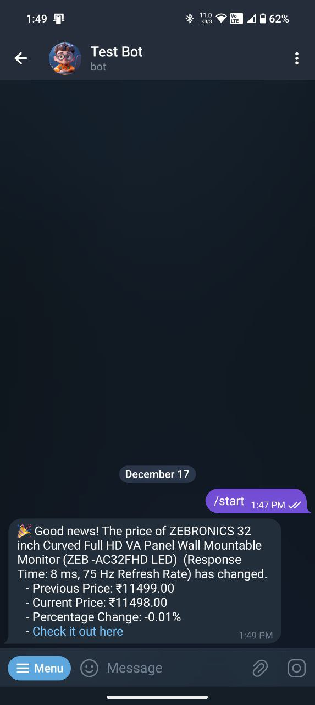

# Price Tracker Bot

Price Tracker Bot is a Telegram bot that helps you track the prices of your favorite products on various online platforms. Whenever there's a change in price, the bot will alert you, ensuring you never miss a deal!

## Demo

<!-- 
 -->


## Features
- Track Prices: Simply send the product link to the bot, and it will start tracking the price for you.
- Automatic Alerts: Receive alerts when there's a price change, helping you stay updated on the latest deals.

## Deployment
### Prerequisites

* Python environment with venv
* MongoDB URI (get it from MongoDB)
* Bot Token
* API ID
* API HASH

## Setup
1. Clone the repository:

```bash
git clone https://github.com/nuhmanpk/PriceTrackerBot.git
```

2. Create a .env file in the project root (Refer .envexample file)

```bash
cd PriceTrackerBot
python -m venv .venv
source .venv/bin/activate (Linux/Mac) or .venv\Scripts\activate (Windows)
pip install -r requirements.txt

```

3. Start the Bot

```bash
python main.py
```


#### Deploy on Koyeb

The fastest way to deploy the application is to click the **Deploy to Koyeb** button below.

[](https://app.koyeb.com/deploy?type=git&repository=github.com/nuhmanpk/PriceTrackerBot&branch=main&name=pricetrackerbot)

## Commands
* /start : start the bot
* /help : Get help
* /my_trackings: View all tracked products.
* /stop <product_id>: Stop tracking a specific product.
* /product <product_id>: Get detailed information about a product.

## Support and Issues
For any issues or feature requests, please open an [issue](https://github.com/nuhmanpk/PriceTrackerBot/issues).

If you find this repo helpful, don't forget add Your Star.
